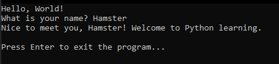

# **First Python Script - Hello, World! with User Interaction**

In this part of my learning journey, I wrote my very first Python script.  
I started with the classic **"Hello, World!"**, but I wanted to make it a bit more interesting for myself.

To make it slightly more challenging, I added a small **function** that asks for my name and prints a **personalized message**.  
I also made sure the program **pauses** at the end so I have time to read the message before the script closes.

---

## **Script**

```python
# first_script.py

# This line prints a simple greeting message to the screen
print("Hello, World!")

# This line asks the user to enter their name and stores the response in the variable 'user_name'
user_name = input("What is your name? ")

# This line prints a personalized message using the value the user provided
# The f"" syntax is called an 'f-string', which allows you to embed variables directly inside a string
print(f"Nice to meet you, {user_name}! Welcome to Python learning.")

# The '\n' creates a line break (a blank line) for better readability in the terminal
# This line then waits for the user to press Enter before the program closes
input("\nPress Enter to exit the program...")
```

## **How to Run the Script**
1. Create the File:
    - Save the above code as first_script.py.
2. Run It Using the Terminal:
    - Open terminal or command prompt.
    - Navigate to the folder where the script is saved.
    - Run the script using:
```bash
   python first_script.py
```

## **What I Learned**
- Printing Output *(print())*
    I learned how to display messages in the terminal using the print() function.
- Getting User Input *(input())*
    I practiced asking for user input and storing it in a variable using input().
- Using f-Strings *(f"...")*
    I learned to build dynamic messages that include variable values with f-strings.
- Using Newline Characters *(\n)*
    I discovered how to format the terminal output with line breaks to improve readability.
- Pausing the Program
    I used input() to pause the program and wait for the user to press Enter before closing it.

### **Example Run**

